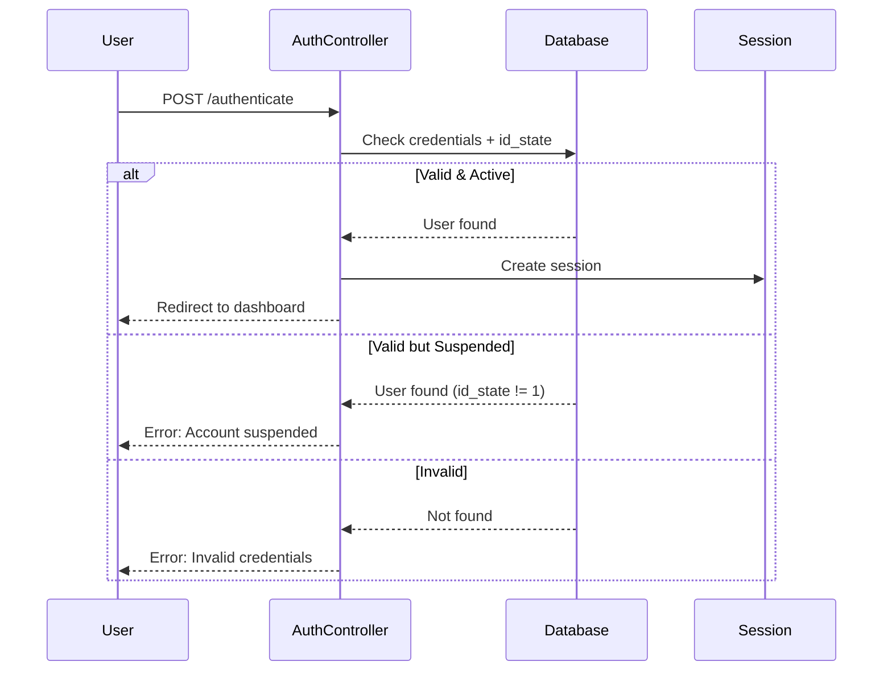

## Overview

The `AuthController` handles all authentication operations including user login, logout, password recovery, and password reset functionality. This controller enforces account status checks and provides Spanish-language feedback.

**Location:** `~/workspace/source/app/Http/Controllers/auth/AuthController.php`

## Methods

### login()

Display the login page.

**Route:** `GET /`

**Authorization:** Public (unauthenticated users)

```php AuthController.php:15-17
public function login() {
    return view('auth.login');
}
```

---

### authenticate()

Process login credentials and create authenticated session.

**Route:** `POST /`

**Authorization:** Public (unauthenticated users)

**Request Parameters:**

<ParamField path="number_documment" type="string" required>
  User's document number (ID number)
</ParamField>

<ParamField path="password" type="string" required>
  User's password
</ParamField>

**Validation:**

```php AuthController.php:29-32
$request->validate([
    'number_documment' => 'required',
    'password' => 'required',
]);
```

**Authentication Logic:**

```php AuthController.php:34-56
// Only allow login if id_state = 1 (active)
if (Auth::attempt([
    'number_documment' => $request->number_documment,
    'password' => $request->password,
    'id_state' => 1
])) {
    return redirect()->route('dashboard');
}

// Check if user exists but is suspended
$user = Users_teacher::where('number_documment', $request->number_documment)->first();

if ($user && $user->id_state != 1) {
    return back()->withErrors([
        'blocked' => 'Tu cuenta se encuentra suspendida. Comunícate con el Director.'
    ]);
}

// Invalid credentials
return back()
    ->withErrors(['invalid_credentials' => 'Número de documento ó contraseña son incorrectas'])
    ->withInput();
```

**Responses:**

<Tabs>
  <Tab title="Success">
    - Redirects to `/dashboard`
    - Session created with authenticated user
  </Tab>
  <Tab title="Suspended Account">
    - Error: "Tu cuenta se encuentra suspendida. Comunícate con el Director."
    - User exists but `id_state != 1`
  </Tab>
  <Tab title="Invalid Credentials">
    - Error: "Número de documento ó contraseña son incorrectas"
    - Document number or password incorrect
  </Tab>
</Tabs>

<Warning>
**Critical Security Feature:** Only users with `id_state = 1` (active) can log in. Suspended accounts are rejected even with correct credentials.
</Warning>

---

### logout()

Log out the user and destroy the session.

**Route:** `GET /logout`

**Authorization:** Authenticated users

```php AuthController.php:19-25
public function logout() {
    Auth::logout();
    Session::flush();
    Session::regenerate(true);

    return redirect()->route('login');
}
```

**Process:**
1. Destroys authentication session
2. Flushes all session data
3. Regenerates session ID (prevents session fixation attacks)
4. Redirects to login page

<Note>
Session regeneration after logout is a security best practice that prevents session fixation vulnerabilities.
</Note>

---

### showForgotPasswordForm()

Display the password recovery form.

**Route:** `GET /forgot-password`

**Authorization:** Public (unauthenticated users)

```php AuthController.php:64-67
public function showForgotPasswordForm()
{
    return view('auth.forgot-password');
}
```

---

### sendResetLink()

Send password reset link via email.

**Route:** `POST /forgot-password`

**Authorization:** Public (unauthenticated users)

**Request Parameters:**

<ParamField path="email" type="string" required>
  User's registered email address
</ParamField>

**Validation:**

```php AuthController.php:71-73
$request->validate([
    'email' => 'required|email'
]);
```

**Logic:**

```php AuthController.php:75-81
$status = Password::sendResetLink(
    $request->only('email')
);

return $status === Password::RESET_LINK_SENT
    ? back()->with('status', 'Te hemos enviado un enlace de recuperación a tu correo')
    : back()->withErrors(['email' => 'No se pudo enviar el enlace']);
```

**Responses:**
- Success: "Te hemos enviado un enlace de recuperación a tu correo"
- Error: "No se pudo enviar el enlace"

---

### showResetPasswordForm()

Display the password reset form with token.

**Route:** `GET /reset-password/{token}`

**Authorization:** Public (with valid token)

**Parameters:**

<ParamField path="token" type="string" required>
  Password reset token from email link
</ParamField>

```php AuthController.php
public function showResetPasswordForm($token)
{
    return view('auth.reset-password', ['token' => $token]);
}
```

---

### resetPassword()

Process password reset with token verification.

**Route:** `POST /reset-password`

**Authorization:** Public (with valid token)

**Request Parameters:**

<ParamField path="token" type="string" required>
  Password reset token
</ParamField>

<ParamField path="email" type="string" required>
  User's email address
</ParamField>

<ParamField path="password" type="string" required>
  New password (minimum 8 characters)
</ParamField>

<ParamField path="password_confirmation" type="string" required>
  Password confirmation (must match password)
</ParamField>

**Validation:**

```php AuthController.php
$request->validate([
    'token' => 'required',
    'email' => 'required|email',
    'password' => 'required|min:8|confirmed',
]);
```

**Logic:**

```php AuthController.php
$status = Password::reset(
    $request->only('email', 'password', 'password_confirmation', 'token'),
    function ($user, $password) {
        $user->forceFill([
            'password' => Hash::make($password)
        ])->save();
    }
);

return $status === Password::PASSWORD_RESET
    ? redirect()->route('login')->with('status', 'Contraseña actualizada exitosamente')
    : back()->withErrors(['email' => 'Error al restablecer la contraseña']);
```

**Responses:**
- Success: "Contraseña actualizada exitosamente" → Redirects to login
- Error: "Error al restablecer la contraseña"

## Authentication Flow



## Password Recovery Flow

<Steps>
  <Step title="Request Reset Link">
    User submits email at `/forgot-password`
    
    System sends reset link via email
  </Step>
  <Step title="Click Reset Link">
    User clicks link in email with unique token
    
    Opens `/reset-password/{token}` form
  </Step>
  <Step title="Submit New Password">
    User enters new password (twice for confirmation)
    
    System validates token and updates password
  </Step>
  <Step title="Login with New Password">
    User redirected to login page
    
    Can now authenticate with new password
  </Step>
</Steps>

## Security Features

<CardGroup cols={2}>
  <Card title="State-Based Access" icon="shield-check">
    Only active users (`id_state = 1`) can log in, even with valid credentials
  </Card>
  <Card title="Session Regeneration" icon="rotate">
    Session ID regenerated on logout to prevent session fixation
  </Card>
  <Card title="Password Hashing" icon="key">
    Passwords hashed using Laravel's bcrypt implementation
  </Card>
  <Card title="Token Expiration" icon="clock">
    Password reset tokens expire after configured time (default 60 minutes)
  </Card>
</CardGroup>

## Database Tables

- **users_teachers** - User credentials and account status
- **password_reset_tokens** - Temporary tokens for password recovery

## Configuration

Mail settings in `.env`:

```bash
MAIL_MAILER=smtp
MAIL_HOST=smtp.gmail.com
MAIL_PORT=587
MAIL_USERNAME=your-email@gmail.com
MAIL_PASSWORD=your-app-password
MAIL_ENCRYPTION=tls
MAIL_FROM_ADDRESS=noreply@bethlemitas.edu.co
MAIL_FROM_NAME="Bethlemitas Support"
```

## Related Documentation

<CardGroup cols={2}>
  <Card title="Authentication Guide" icon="book" href="/guides/authentication">
    User guide for login and password recovery
  </Card>
  <Card title="ProfileController" icon="user" href="/api/controllers/profile-controller">
    Profile management after authentication
  </Card>
  <Card title="Authentication Routes" icon="route" href="/api/routes/authentication">
    Complete route reference
  </Card>
</CardGroup>