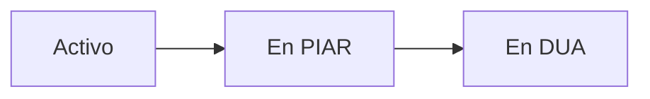

## Overview

Psychologists use the reporting system to document evaluations, track interventions, and make recommendations for student support. This guide covers the complete reporting workflow.

## Creating Psychological Reports

<Steps>
  <Step title="Access Student Report Page">
    From the student list, click on a student to access their report page.
    
    **Route:** `GET /report/student/{id}`
    
    This displays the report creation form pre-populated with student information.
  </Step>

  <Step title="Complete Report Information">
    Fill in the psychological evaluation details:

    <ParamField path="age_student" type="integer" required>
      Student's current age
    </ParamField>

    <ParamField path="group_student" type="string" required>
      Student's current group/section
    </ParamField>

    <ParamField path="director_group_student" type="string" required>
      Name of the group director/homeroom teacher
    </ParamField>

    <ParamField path="title_report" type="string" required>
      Report title or subject
    </ParamField>

    <ParamField path="reason_inquiry" type="text" required>
      Reason for the psychological inquiry and evaluation
    </ParamField>

    <ParamField path="recomendations" type="text" required>
      Professional recommendations and intervention strategies
    </ParamField>

    <ParamField path="annex_one" type="file">
      PDF attachment for detailed reports or documentation
    </ParamField>
  </Step>

  <Step title="Submit the Report">
    Submit the form to create the psychological report.
    
    **Route:** `POST /store/report/student/{id}`
  </Step>
</Steps>

## Report Creation Logic

```php PsicoController.php
public function store_report_student(Request $request, $id)
{
    $request->validate([
        'age_student' => 'required|integer|min:0',
        'group_student' => 'required|string',
        'director_group_student' => 'required|string',
        'title_report' => 'required|string',
        'reason_inquiry' => 'required|string',
        'recomendations' => 'required|string',
        'annex_one' => 'nullable|file|mimes:pdf|max:10240',
    ]);

    $psychoorientation = new Psychoorientation();
    $psychoorientation->psychologist_writes = Auth::id();
    $psychoorientation->id_user_student = $id;
    $psychoorientation->age_student = $request->age_student;
    $psychoorientation->group_student = $request->group_student;
    $psychoorientation->director_group_student = $request->director_group_student;
    $psychoorientation->title_report = $request->title_report;
    $psychoorientation->reason_inquiry = $request->reason_inquiry;
    $psychoorientation->recomendations = $request->recomendations;

    if ($request->hasFile('annex_one')) {
        $file = $request->file('annex_one');
        $filename = time() . '_' . $file->getClientOriginalName();
        $path = $file->storeAs('psycho_reports', $filename, 'public');
        $psychoorientation->annex_one = $path;
    }

    $psychoorientation->save();

    return redirect()->back()->with('success', 'Informe creado exitosamente.');
}
```

<Note>
PDF attachments are limited to 10MB and stored in the `storage/app/public/psycho_reports/` directory.
</Note>

## Viewing Current Reports

Access a student's most recent report:

**Route:** `GET /psico/student/{id}/report`

```php PsicoController.php
public function current_report_student($id)
{
    $student = Users_student::with([
        'psychoorientations' => function ($query) {
            $query->latest()->first();
        },
        'degree',
        'group'
    ])->findOrFail($id);

    return view('psycho.currentReport', compact('student'));
}
```

## Tracking Student Progress

### Student State Progression

Students progress through support levels:



<Steps>
  <Step title="Active (Activo)">
    Initial referral state. Psychologist reviews the case and decides on next steps.
  </Step>
  <Step title="PIAR (Individual Plan)">
    Student requires individualized adjustments. Psychologist creates a formal PIAR document.
    
    **Transition Route:** `PUT /accept/student`
  </Step>
  <Step title="DUA (Universal Design)">
    Student moves to classroom-level universal design interventions.
  </Step>
</Steps>

### Accepting Students to PIAR

Psychologists can promote students from Active to PIAR status:

```php PsicoController.php
public function accept_student_to_piar(Request $request)
{
    $student = Users_student::findOrFail($request->student_id);
    $piar_state = State::where('state', 'en PIAR')->firstOrFail();
    
    $student->id_state = $piar_state->id;
    $student->save();
    
    return redirect()->back()->with('success', 'Estudiante aceptado en PIAR.');
}
```

<Warning>
State transitions are permanent. Ensure proper evaluation before moving students to PIAR or DUA status.
</Warning>

## Managing Historical Reports

### Viewing Report History

Access all historical reports for a student:

**Route:** `GET /student/history/{id}`

This displays:
- All psychological reports (chronological order)
- All referrals
- State change history
- PIAR/DUA documentation

### Editing Historical Reports

Psychologists can update past reports:

**Route:** `GET /history/details/report/{id}`
**Update Route:** `PUT /edit/history/details/report/{id}`

```php PsicoController.php
public function update_history_details_report(Request $request, $id)
{
    $request->validate([
        'title_report' => 'required|string',
        'reason_inquiry' => 'required|string',
        'recomendations' => 'required|string',
    ]);

    $report = Psychoorientation::findOrFail($id);
    $report->update($request->only([
        'title_report',
        'reason_inquiry',
        'recomendations'
    ]));

    return redirect()->back()->with('success', 'Informe actualizado.');
}
```

## File Management

### Uploading Attachments

Reports support PDF attachments for detailed documentation:

- **Field:** `annex_one`
- **Format:** PDF only
- **Max Size:** 10MB
- **Storage:** `storage/app/public/psycho_reports/`

### Accessing Attachments

Attached files are accessible through:

```php
$reportPath = Storage::url($psychoorientation->annex_one);
```

<Note>
Ensure the symbolic link is created: `php artisan storage:link`
</Note>

## Common Reporting Workflows

<AccordionGroup>
  <Accordion title="Initial Evaluation Report">
    1. Review the referral submitted by the teacher
    2. Conduct student evaluation
    3. Create initial psychological report
    4. Decide: keep Active, or move to PIAR
  </Accordion>

  <Accordion title="PIAR Documentation">
    1. Accept student to PIAR status
    2. Create comprehensive PIAR report with adjustments
    3. Attach PDF with detailed intervention plan
    4. Share recommendations with teachers
  </Accordion>

  <Accordion title="Follow-up Reports">
    1. Access student history
    2. Review previous reports and progress
    3. Create new follow-up report
    4. Update recommendations based on progress
  </Accordion>

  <Accordion title="DUA Transition">
    1. Evaluate if student is ready for DUA
    2. Update student state to "en DUA"
    3. Document transition rationale
    4. Provide classroom-level intervention strategies
  </Accordion>
</AccordionGroup>

## Best Practices

<CardGroup cols={2}>
  <Card title="Comprehensive Documentation" icon="file-lines">
    Include detailed observations, evaluation methods, and evidence-based recommendations in every report.
  </Card>
  <Card title="Timely Follow-ups" icon="clock">
    Schedule regular follow-up reports to track student progress and adjust interventions.
  </Card>
  <Card title="Secure Attachments" icon="lock">
    Use PDF attachments for sensitive information and ensure file size limits are respected.
  </Card>
  <Card title="Collaboration" icon="handshake">
    Share reports with teachers and coordinate intervention strategies across the team.
  </Card>
</CardGroup>

## Related Features

<CardGroup cols={2}>
  <Card title="Psycho-Orientation" icon="brain" href="/features/psycho-orientation">
    Learn about the psychological support system
  </Card>
  <Card title="PIAR & DUA" icon="clipboard-list" href="/features/piar-dua-management">
    Understand PIAR and DUA programs
  </Card>
  <Card title="Managing Students" icon="users" href="/guides/managing-students">
    Track and update student information
  </Card>
  <Card title="Psychologist Role" icon="user-doctor" href="/roles/psychologist">
    Full capabilities of the psychologist role
  </Card>
</CardGroup>