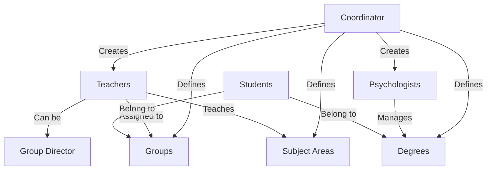

## Overview

The **Coordinator** role has the highest level of administrative access in the Bethlemitas Student Support System. Coordinators are responsible for managing users, academic structure, and overall system configuration.

<Note>
  Coordinators have exclusive access to create and manage teachers, psychologists, academic groups, degrees, and subject areas.
</Note>

## Role Verification

The coordinator role is protected by the `RoleMiddleware` which verifies user permissions:

```php
// app/Http/Middleware/RoleMiddleware.php:14
if (!Auth::check() || !Auth::user()->hasRole('coordinador')) {
    abort(403, 'No tienes permiso para acceder a esta página.');
}
```

All coordinator routes are wrapped in this middleware to ensure only authorized users can access administrative functions.

## Core Capabilities

<CardGroup cols={2}>
  <Card title="User Management" icon="users">
    Create, edit, suspend, and activate teachers and psychologists
  </Card>
  <Card title="Academic Structure" icon="building-columns">
    Manage groups, degrees, and subject areas
  </Card>
  <Card title="Role Assignment" icon="user-shield">
    Assign roles and permissions to staff members
  </Card>
  <Card title="System Configuration" icon="gear">
    Configure academic workloads and assignments
  </Card>
</CardGroup>

## User Management

Coordinators have complete control over user accounts for teachers and psychologists.

### Creating Users

<Accordion title="Create Teacher">
  **Route:** `/create/user` (GET)
  
  **Controller:** `CreateController@create_user` (source/app/Http/Controllers/CreateController.php:22)
  
  The coordinator can create teacher accounts with the following capabilities:
  
  - Assign multiple subject areas
  - Assign multiple groups
  - Designate as group director (optional)
  - Map specific areas to specific groups
  - Set initial active state
  
  **Validation Rules:**
  ```php
  'number_documment' => 'required|digits_between:1,11|unique:users_teachers'
  'email' => 'required|unique:users_teachers'
  'areas' => 'required|array'
  'groups' => 'required|array'
  'group_director' => 'nullable|unique:users_teachers'
  'area_id' => 'required|array'
  'groups_asig' => 'required|array'
  ```
  
  **Business Logic:**
  - Verifies that assigned groups match the areas being taught
  - Prevents duplicate area assignments in the same group
  - Default password is set to the user's document number
</Accordion>

<Accordion title="Create Psychologist">
  **Route:** `/create/user` (GET)
  
  **Controller:** `CreateController@store_user` (source/app/Http/Controllers/CreateController.php:228)
  
  Creating a psychologist involves:
  
  - Assigning specific degree levels (grades) to manage
  - Each degree can only be assigned to one psychologist
  - Automatic role assignment as 'psicoorientador'
  
  **Validation Rules:**
  ```php
  'number_documment' => 'required|digits_between:1,11|unique:users_teachers'
  'email' => 'required|unique:users_teachers'
  'load_degree' => 'required|array'
  'load_degree.*' => 'exists:degrees,id'
  ```
  
  **Business Logic:**
  - Ensures no degree is assigned to multiple psychologists
  - Stores assignments in `users_load_degrees` table
</Accordion>

### Listing Users

**Route:** `/listing/users` (GET)

**Controller:** `CreateController@index_users` (source/app/Http/Controllers/CreateController.php:303)

The user listing page provides:

- Paginated list of teachers and psychologists (15 per page)
- Search functionality by name, last name, document number, or area
- Filter by user state (active/suspended)
- View assigned areas, groups, and degrees
- Quick access to edit and suspend/activate actions

### Editing Users

**Route:** `/edit/{id}/user` (GET)

**Controller:** `CreateController@edit_user` (source/app/Http/Controllers/CreateController.php:353)

Coordinators can modify:

- Personal information (name, email, document)
- Role assignments
- Academic assignments (areas, groups, degrees)
- Group director designation

<Warning>
  The system tracks changes and only updates records when actual modifications are detected to maintain data integrity.
</Warning>

### Suspending/Activating Users

**Route:** `/delete/user/{id}` (PUT)

**Controller:** `CreateController@destroy_user` (source/app/Http/Controllers/CreateController.php:650)

This is a toggle action that:
- Changes state from active (1) to suspended (2)
- Changes state from suspended (2) to active (1)
- Does not permanently delete user records

```php
// app/Http/Controllers/CreateController.php:655
if ($user->id_state == 1) {
    $user->id_state = 2;
    $message = 'Usuario suspendido correctamente';
} else {
    $user->id_state = 1;
    $message = 'Usuario activado correctamente';
}
```

## Academic Structure Management

### Groups

<CardGroup cols={2}>
  <Card title="Create Group" icon="plus">
    **Route:** `/create/group`
    
    **Controller:** `CreateGroupController@create_group`
  </Card>
  <Card title="Edit Group" icon="pen">
    **Route:** `/update/group` (PUT)
    
    **Controller:** `CreateGroupController@update_group`
  </Card>
  <Card title="Delete Group" icon="trash">
    **Route:** `/delete/group/{id}` (DELETE)
    
    **Controller:** `CreateGroupController@destroy_group`
  </Card>
  <Card title="View Groups" icon="list">
    Groups are displayed in natural order (1, 2, 3... not 1, 10, 11...)
  </Card>
</CardGroup>

### Degrees

<CardGroup cols={2}>
  <Card title="Create Degree" icon="plus">
    **Route:** `/create/degree`
    
    **Controller:** `CreateDegreeController@create_degree`
  </Card>
  <Card title="Edit Degree" icon="pen">
    **Route:** `/update/degree` (PUT)
    
    **Controller:** `CreateDegreeController@update_degree`
  </Card>
  <Card title="Delete Degree" icon="trash">
    **Route:** `/delete/degree/{id}` (DELETE)
    
    **Controller:** `CreateDegreeController@destroy_degree`
  </Card>
  <Card title="View Degrees" icon="list">
    Degrees are ordered numerically using CAST in SQL queries
  </Card>
</CardGroup>

### Subject Areas

<CardGroup cols={2}>
  <Card title="Create Area" icon="plus">
    **Route:** `/create/area`
    
    **Controller:** `CreateAreaController@create_area`
  </Card>
  <Card title="Edit Area" icon="pen">
    **Route:** `/update/area` (PUT)
    
    **Controller:** `CreateAreaController@update_area`
  </Card>
  <Card title="Delete Area" icon="trash">
    **Route:** `/delete/area/{id}` (DELETE)
    
    **Controller:** `CreateAreaController@destroy_area`
  </Card>
  <Card title="View Areas" icon="list">
    Areas are ordered alphabetically by name
  </Card>
</CardGroup>

## Protected Routes

All coordinator routes are protected by the `RoleMiddleware`. Here's the complete list:

```php
// routes/web.php:91
Route::middleware([RoleMiddleware::class])->group(function () {
    
    // User Management
    Route::get('/create/user', [CreateController::class, 'create_user']);
    Route::post('/store/user', [CreateController::class, 'store_user']);
    Route::get('/listing/users', [CreateController::class, 'index_users']);
    Route::get('/edit/{id}/user', [CreateController::class, 'edit_user']);
    Route::put('/update/user/{id}', [CreateController::class, 'update_user']);
    Route::put('/delete/user/{id}', [CreateController::class, 'destroy_user']);
    
    // Group Management
    Route::get('/create/group', [CreateGroupController::class, 'create_group']);
    Route::post('/store/group', [CreateGroupController::class, 'store_group']);
    Route::put('/update/group', [CreateGroupController::class, 'update_group']);
    Route::delete('/delete/group/{id}', [CreateGroupController::class, 'destroy_group']);
    
    // Degree Management
    Route::get('/create/degree', [CreateDegreeController::class, 'create_degree']);
    Route::post('/store/degree', [CreateDegreeController::class, 'store_degree']);
    Route::put('/update/degree', [CreateDegreeController::class, 'update_degree']);
    Route::delete('/delete/degree/{id}', [CreateDegreeController::class, 'destroy_degree']);
    
    // Area Management
    Route::get('/create/area', [CreateAreaController::class, 'create_area']);
    Route::post('/store/area', [CreateAreaController::class, 'store_area']);
    Route::put('/update/area', [CreateAreaController::class, 'update_area']);
    Route::delete('/delete/area/{id}', [CreateAreaController::class, 'destroy_area']);
});
```

## Access Restrictions

<Warning>
  Coordinators cannot be created through the web interface. Coordinator accounts must be created directly in the database or through seeding.
</Warning>

The coordinator role is excluded from the role selection dropdown:

```php
// app/Http/Controllers/CreateController.php:28
$roles = Role::whereNotIn('name', ['estudiante', 'coordinador'])->get();
```

## Common Use Cases

<Steps>
  <Step title="Beginning of School Year">
    1. Create or update academic degrees
    2. Create or update groups
    3. Define subject areas
    4. Create teacher accounts
    5. Assign teachers to areas and groups
    6. Create psychologist accounts
    7. Assign psychologists to degree levels
  </Step>
  
  <Step title="Mid-Year Adjustments">
    1. Reassign teachers to different groups or areas
    2. Update psychologist degree assignments
    3. Suspend inactive user accounts
    4. Reactivate users as needed
  </Step>
  
  <Step title="Maintenance">
    1. Review user listings regularly
    2. Ensure each degree has an assigned psychologist
    3. Verify no duplicate area-group assignments
    4. Update user information as needed
  </Step>
</Steps>

## Data Relationships

Understanding how coordinator-managed data relates:



## Best Practices

<Note>
  - Always verify psychologist coverage for all degrees before the school year starts
  - Use the search and filter features to quickly find users
  - Suspend rather than delete users to maintain historical records
  - Ensure area-group assignments don't conflict between teachers
  - Keep user emails updated for system notifications
</Note>

## Related Documentation

- [Teacher Role](/roles/teacher)
- [Psychologist Role](/roles/psychologist)
- [Authentication System](/core/authentication)
- [Middleware Reference](/core/middleware)