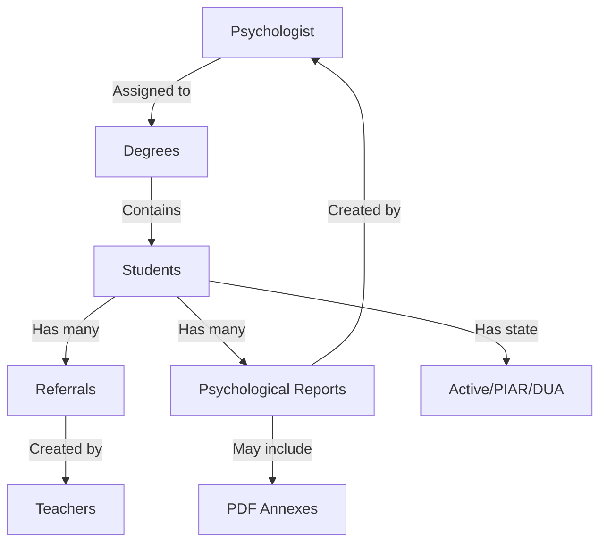

## Overview

The **Psychologist** (Psicoorientador) role manages student referrals, conducts evaluations, creates psychological reports, and tracks students through PIAR and DUA processes. Psychologists are assigned to specific grade levels (degrees) and handle all referred students within their assigned grades.

<Note>
  Psychologists have comprehensive access to student records, can create reports, update referral details, and manage student transitions between support levels.
</Note>

## Role Verification

The psychologist role is protected by the `RolePsicoorientadorMiddleware`:

```php
// app/Http/Middleware/RolePsicoorientadorMiddleware.php:15
if (!Auth::check() || !Auth::user()->hasRole('psicoorientador')) {
    abort(403, 'No tienes permiso para acceder a esta página.');
}
```

## Core Capabilities

<CardGroup cols={2}>
  <Card title="Referral Management" icon="inbox">
    Review and process student referrals from teachers
  </Card>
  <Card title="Psychological Reports" icon="file-medical">
    Create detailed psychological reports with recommendations
  </Card>
  <Card title="Student Tracking" icon="chart-line">
    Monitor students across active, PIAR, and DUA states
  </Card>
  <Card title="Case History" icon="clock-rotate-left">
    Access complete historical records of referrals and reports
  </Card>
</CardGroup>

## Grade Assignment

Psychologists are assigned to specific grade levels (degrees) by the coordinator. This assignment determines which student referrals they can access.

### Assignment Structure

```php
// app/Models/Users_teacher.php:88
public function loadDegrees()
{
    return $this->hasMany(Users_load_degree::class, 'id_user');
}

public function degrees()
{
    return $this->belongsToMany(
        Degree::class,
        'users_load_degrees',
        'id_user',
        'id_degree'
    );
}
```

<Warning>
  Each grade level can only be assigned to one psychologist at a time. This ensures clear responsibility and prevents duplicate case management.
</Warning>

## Student Management by State

Psychologists can view students filtered by their current support state.

### Active Students

**Route:** `/psico/students/active` (GET)

**Controller:** `PsicoController@index_students_active_psico` (source/app/Http/Controllers/PsicoController.php:66)

Shows **all students** in the psychologist's assigned grades, regardless of state.

**Features:**
- Search by name, last name, or document number
- View degree and group information
- See if student has psychological reports (annex count)
- Paginated results (15 per page)

```php
// app/Http/Controllers/PsicoController.php:74
$query = Users_student::whereIn('id_degree', $load_degree)
    ->with(['degree','group'])
    ->withCount([
        'psychoorientations as has_annex' => function ($query) {
            $query->whereNotNull('annex_one');
        }
    ]);
```

### Students in PIAR

**Route:** `/psico/students/piar` (GET)

**Controller:** `PsicoController@index_students_piar_psico` (source/app/Http/Controllers/PsicoController.php:104)

Filters students with state 'en PIAR'.

### Students in DUA

**Route:** `/psico/students/dua` (GET)

**Controller:** `PsicoController@index_students_dua_psico` (source/app/Http/Controllers/PsicoController.php:109)

Filters students with state 'en DUA'.

### New Referrals

**Route:** `/index/students/remitted/psico` (GET)

**Controller:** `PsicoController@index_student_remitted_psico` (source/app/Http/Controllers/PsicoController.php:114)

Shows students with 'activo' state in the psychologist's assigned grades. These are new referrals awaiting review.

```php
// app/Http/Controllers/PsicoController.php:122
$query = Users_student::whereHas('states', function ($q) {
        $q->where('state', 'activo');
    })
    ->whereIn('id_degree', $load_degree);
```

## Referral Details and Updates

### Viewing Referral Details

**Route:** `/details/referral/{id}` (GET)

**Controller:** `PsicoController@detailsReferral` (source/app/Http/Controllers/PsicoController.php:148)

Displays comprehensive information about a student referral:

<Accordion title="Information Displayed">
  **Student Information:**
  - Personal details (name, document, age)
  - Current degree and group
  - Current state
  
  **Referral Information:**
  - Referring teacher
  - Reason for referral
  - Observations
  - Strategies attempted
  - Referral date
  
  **Related Reports:**
  - Latest psychological report (if exists)
  
  ```php
  // app/Http/Controllers/PsicoController.php:150
  $info_student = Users_student::findOrFail($id);
  
  $info_referral = Referral::where('id_user_student', $id)
      ->latest()
      ->first();
  
  $report = Psychoorientation::where('id_user_student', $id)
      ->latest()
      ->first();
  ```
</Accordion>

### Updating Referral Details

**Route:** `/edit/details/referral/{id}` (PUT)

**Controller:** `PsicoController@update_details_referral` (source/app/Http/Controllers/PsicoController.php:172)

Psychologists can update both student information and referral details:

**Editable Fields:**
- Student: document number, name, last name, age, degree, group
- Referral: reason, observations, strategies

```php
// app/Http/Controllers/PsicoController.php:189
$student->update([
    'number_documment' => $request->number_documment,
    'name'             => $request->name,
    'last_name'        => $request->last_name,
    'id_degree'        => $request->degree,
    'id_group'         => $request->group,
    'age'              => $request->age,
]);

if ($referral) {
    $referral->update([
        'reason'      => $request->reason_referral,
        'observation' => $request->observation,
        'strategies'  => $request->strategies,
        'course'      => Degree::find($request->degree)->degree,
    ]);
}
```

## Psychological Reports

### Creating a Report

**Route:** `/report/student/{id}` (GET)

**Controller:** `PsicoController@report_student` (source/app/Http/Controllers/PsicoController.php:214)

Provides a form to create a comprehensive psychological report.

**Route:** `/store/report/student/{id}` (POST)

**Controller:** `PsicoController@store_report_student` (source/app/Http/Controllers/PsicoController.php:230)

<Accordion title="Report Creation Process">
  **Required Fields:**
  ```php
  'number_documment' => 'required|digits_between:1,20'
  'name'             => 'required|string'
  'last_name'        => 'required|string'
  'degree'           => 'required|exists:degrees,id'
  'group'            => 'required|exists:groups,id'
  'age'              => 'required|integer'
  'state'            => 'required|exists:states,id'
  'title_report'     => 'required|string'
  'reason_inquiry'   => 'required|string'
  'recomendations'   => 'required|string'
  'annex_one'        => 'nullable|mimes:pdf|max:5120'
  ```
  
  **File Upload:**
  Reports can include PDF attachments (max 5MB). Files are stored with a naming convention:
  ```php
  // app/Http/Controllers/PsicoController.php:276
  $fileName = 'student_' . $studentId . '_' . now()->format('Ymd_His') . '.pdf';
  
  $annexPath = $file->storeAs(
      'annexes/student_' . $studentId,
      $fileName,
      'public'
  );
  ```
  
  **Automatic Data Collection:**
  The system automatically captures:
  - Psychologist who writes the report (authenticated user)
  - Student age at time of report
  - Current group
  - Group director name
  
  ```php
  // app/Http/Controllers/PsicoController.php:262
  $group = Group::findOrFail($request->group);
  $director = Users_teacher::where('group_director', $request->group)->first();
  
  Psychoorientation::create([
      'psychologist_writes'    => Auth::id(),
      'id_user_student'        => $id,
      'age_student'            => $request->age,
      'group_student'          => $group->group,
      'director_group_student' => $director
          ? $director->name . ' ' . $director->last_name
          : 'No asignado',
      'title_report'           => $request->title_report,
      'reason_inquiry'         => $request->reason_inquiry,
      'recomendations'         => $request->recomendations,
      'annex_one'              => $annexPath,
  ]);
  ```
  
  **State Update:**
  Creating a report can update the student's state (e.g., from 'activo' to 'en PIAR' or 'en DUA').
</Accordion>

### Viewing Current Report

**Route:** `/psico/student/{id}/report` (GET)

**Controller:** `PsicoController@current_report_student` (source/app/Http/Controllers/PsicoController.php:382)

Displays the most recent psychological report for a student:

```php
// app/Http/Controllers/PsicoController.php:387
$report = Psychoorientation::where('id_user_student', $id)
    ->latest()
    ->first();
```

## Student History

### Complete History View

**Route:** `/student/history/{id}` (GET)

**Controller:** `PsicoController@show_student_history` (source/app/Http/Controllers/PsicoController.php:316)

Provides a comprehensive timeline of all referrals and reports for a student.

```php
// app/Http/Controllers/PsicoController.php:318
$student = Users_student::findOrFail($id);

$referrals = Referral::where('id_user_student', $id)
    ->orderBy('created_at', 'desc')
    ->paginate(10);

$reports = Psychoorientation::where('id_user_student', $id)
    ->orderBy('created_at', 'desc')
    ->paginate(10);
```

**Features:**
- Chronological list of all referrals
- Chronological list of all psychological reports
- Separate pagination for referrals and reports (10 per page each)
- Access to historical details and ability to edit past records

### Historical Referral Details

**Route:** `/history/details/referral/{id}` (GET)

**Controller:** `PsicoController@history_details_referral` (source/app/Http/Controllers/PsicoController.php:339)

View a specific historical referral with related student and report information.

**Route:** `/edit/history/details/referral/{id}` (PUT)

**Controller:** `PsicoController@update_history_details_referral` (source/app/Http/Controllers/PsicoController.php:357)

Update historical referral information:

```php
// app/Http/Controllers/PsicoController.php:365
$referral->update([
    'reason'      => $request->reason,
    'observation' => $request->observation,
    'strategies'  => $request->strategies,
]);
```

### Historical Report Details

**Route:** `/history/details/report/{id}` (GET)

**Controller:** `PsicoController@history_details_report` (source/app/Http/Controllers/PsicoController.php:393)

**Route:** `/edit/history/details/report/{id}` (PUT)

**Controller:** `PsicoController@update_history_details_report` (source/app/Http/Controllers/PsicoController.php:402)

Update historical reports including:
- Report title
- Reason for inquiry
- Recommendations
- PDF annex (replaces old file if new one uploaded)

<Accordion title="File Replacement Logic">
  ```php
  // app/Http/Controllers/PsicoController.php:419
  if ($request->hasFile('annex_one')) {
      
      // Eliminar archivo anterior
      if ($report->annex_one && Storage::disk('public')->exists($report->annex_one)) {
          Storage::disk('public')->delete($report->annex_one);
      }
      
      $file = $request->file('annex_one');
      $fileName = 'student_' . $report->id_user_student . '_' . now()->format('Ymd_His') . '.pdf';
      
      $annexPath = $file->storeAs(
          'annexes/student_' . $report->id_user_student,
          $fileName,
          'public'
      );
      
      $report->annex_one = $annexPath;
  }
  
  $report->save();
  ```
</Accordion>

## PIAR Process Management

### Accepting Student to PIAR

**Route:** `/accept/student` (PUT)

**Controller:** `PsicoController@accept_student_to_piar` (source/app/Http/Controllers/PsicoController.php:203)

This route allows psychologists to transition students into the PIAR process, updating their state and triggering associated workflows.

<Note>
  The PIAR (Plan Individual de Ajustes Razonables) is a personalized support plan for students with specific educational needs.
</Note>

## Shared Capabilities with Teachers

Psychologists can also perform some teacher functions through shared routes:

```php
// routes/web.php:137
Route::middleware([RolePsicoorientadorAndDocenteMiddleware::class])->group(function () {
    
    // Psychologists can also create referrals
    Route::get('/create/referral', [CreateReferralController::class, 'create_referral']);
    Route::post('/store/referral', [CreateReferralController::class, 'store_referral']);
    
    // And edit student information
    Route::get('/edit/student/{id}', [CreateReferralController::class, 'edit_student']);
    Route::put('/update/student/{id}', [CreateReferralController::class, 'update_student']);
});
```

This allows psychologists to create additional referrals if needed during their case management process.

## Protected Routes

Complete list of psychologist-exclusive routes:

```php
// routes/web.php:158
Route::middleware([RolePsicoorientadorMiddleware::class])->group(function () {
    
    // Student listings by state
    Route::get('/index/students/remitted/psico', [PsicoController::class, 'index_student_remitted_psico']);
    Route::get('/psico/students/active', [PsicoController::class, 'index_students_active_psico']);
    Route::get('/psico/students/piar', [PsicoController::class, 'index_students_piar_psico']);
    Route::get('/psico/students/dua', [PsicoController::class, 'index_students_dua_psico']);
    
    // Referral management
    Route::get('/details/referral/{id}', [PsicoController::class, 'detailsReferral']);
    Route::put('/edit/details/referral/{id}', [PsicoController::class, 'update_details_referral']);
    
    // Report management
    Route::get('/psico/student/{id}/report', [PsicoController::class, 'current_report_student']);
    Route::get('/report/student/{id}', [PsicoController::class, 'report_student']);
    Route::post('/store/report/student/{id}', [PsicoController::class, 'store_report_student']);
    
    // Student history
    Route::get('/student/history/{id}', [PsicoController::class, 'show_student_history']);
    Route::get('/history/details/referral/{id}', [PsicoController::class, 'history_details_referral']);
    Route::get('/history/details/report/{id}', [PsicoController::class, 'history_details_report']);
    Route::put('/edit/history/details/referral/{id}', [PsicoController::class, 'update_history_details_referral']);
    Route::put('/edit/history/details/report/{id}', [PsicoController::class, 'update_history_details_report']);
    
    // PIAR process
    Route::put('/accept/student', [PsicoController::class, 'accept_student_to_piar']);
});
```

## Common Workflows

<Steps>
  <Step title="Review New Referrals">
    Check `/index/students/remitted/psico` daily for new referrals from teachers.
  </Step>
  
  <Step title="Examine Referral Details">
    Click on a student to view `/details/referral/{id}` and review:
    - Teacher observations
    - Strategies attempted
    - Student background
  </Step>
  
  <Step title="Update Information if Needed">
    Correct or add to student and referral information using the edit functionality.
  </Step>
  
  <Step title="Conduct Evaluation">
    Perform psychological evaluation, gather additional information, and consult with teachers/parents.
  </Step>
  
  <Step title="Create Report">
    Document findings in `/report/student/{id}`:
    - Write detailed psychological report
    - Include recommendations
    - Attach supporting documents (PDF)
    - Update student state (PIAR, DUA, or keep active)
  </Step>
  
  <Step title="Monitor Progress">
    Use state-filtered views to track students:
    - `/psico/students/piar` for PIAR students
    - `/psico/students/dua` for DUA students
  </Step>
  
  <Step title="Maintain Records">
    Access `/student/history/{id}` to review complete case history and update reports as needed.
  </Step>
</Steps>

## Data Organization

Psychologists work with a hierarchical data structure:



## Best Practices

<Note>
  - Check new referrals daily to ensure timely response
  - Review complete student history before creating reports
  - Be thorough in recommendations and documentation
  - Keep file attachments under 5MB for optimal performance
  - Update student states appropriately as cases progress
  - Collaborate with teachers through the shared edit capabilities
  - Use search functionality to quickly find specific students
  - Maintain organized annexes with clear naming conventions
</Note>

## File Management

Psychological report attachments are stored in a structured directory:

```
storage/app/public/annexes/
  └── student_{id}/
      ├── student_{id}_20260309_143022.pdf
      ├── student_{id}_20260315_091544.pdf
      └── ...
```

Each student has their own directory, and files include timestamps to prevent overwrites and maintain version history.

## Related Documentation

- [Teacher Role](/roles/teacher)
- [Coordinator Role](/roles/coordinator)
- [Report System](/features/reports)
- [PIAR/DUA Processes](/features/support-processes)